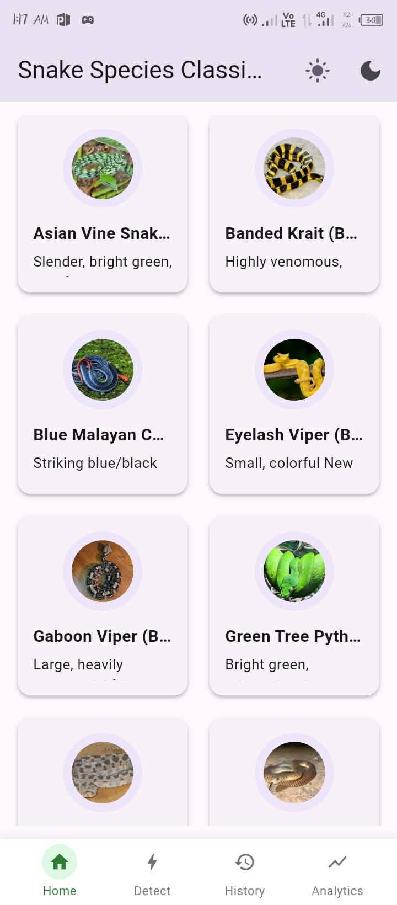
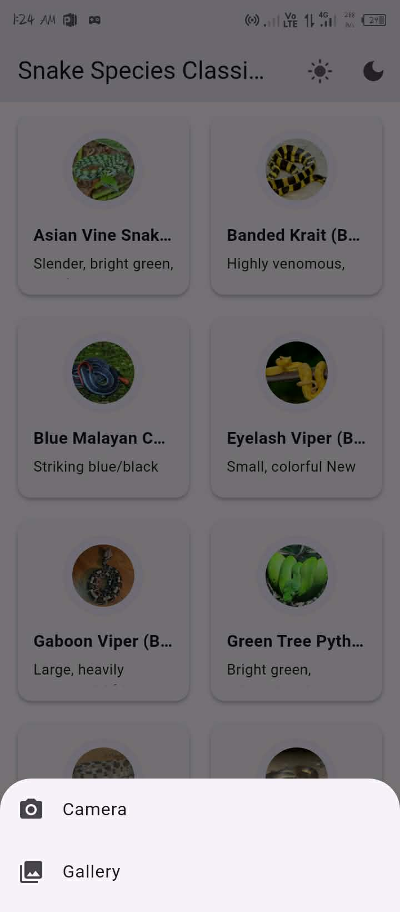
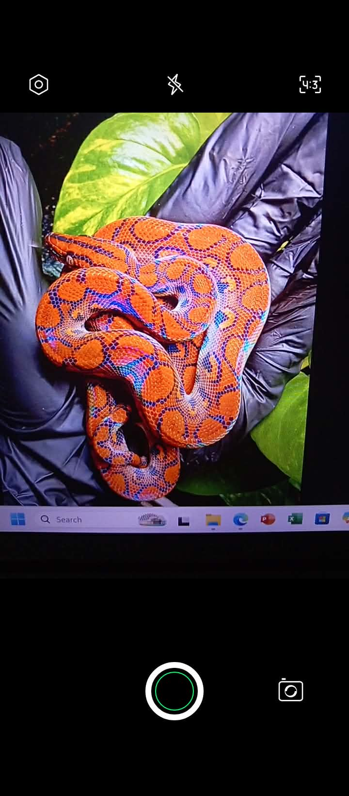
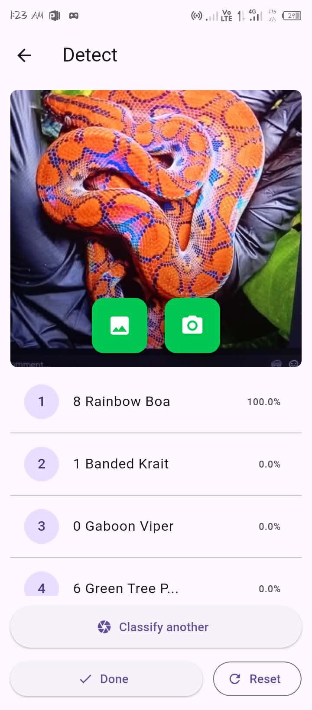
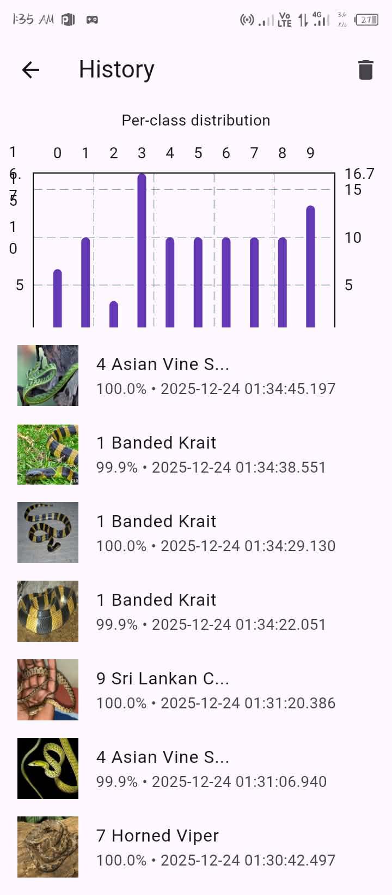
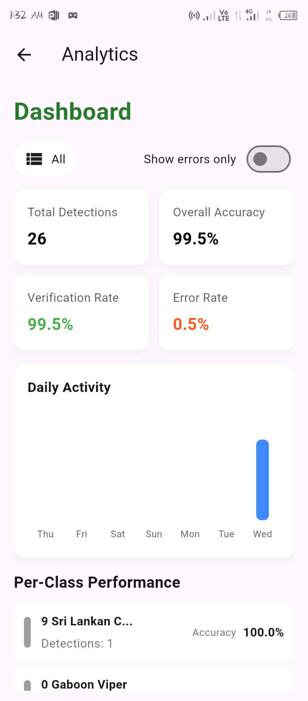

# 🐍 Snake Species Classification Project

## Project Description

This project is a **machine learning classification system** that identifies different snake species from images using a trained TensorFlow Lite model. It can be used in mobile apps, desktop apps, or embedded systems to classify snakes in real time. The repository includes the trained model, screenshots of classification results, and example outputs.  

## Why This Project Was Created

This project was created to:
- Demonstrate the use of **TensorFlow Lite** for image classification tasks.
- Provide a lightweight model suitable for mobile and embedded platforms.
- Help users understand how machine learning can be applied to species recognition and biodiversity monitoring.
- Support educational and conservation-oriented tools by automating snake species identification.

## Tools Used

✔️ **TensorFlow Lite** – Model format and inference engine  
✔️ Python / ML Libraries – (for model evaluation and preprocessing)  
✔️ Firebase (optional) – For backend integration in app prototypes  
✔️ Image assets and model screenshots included for documentation and demo

---

## Snake Species Reference Table

This table shows the snake species this model can classify. Each entry includes an image, common name, scientific name, and a brief description.

| Image | Class Name | Scientific Name | Description |
|-------|------------|----------------|-------------|
|  | **Banded Krait** | *Bungarus fasciatus* | Highly venomous snake with black and yellow bands. |
|  | **Gaboon Viper** | *Bitis gabonica* | Large viper with striking geometric patterns and long fangs. |
|  | **Blue Malayan Coral Snake** | *Calliophis bivirgatus* | Small but extremely venomous, with striking blue coloration. |
|  | **King Brown Snake** | *Pseudechis australis* | Large, highly venomous snake native to Australia. |
|  | **Rainbow Boa** | *Epicrates cenchria* | Non-venomous snake known for its iridescent skin. |
|  | **Green Tree Python** | *Morelia viridis* | Arboreal snake with vibrant green coloration. |
|  | **Eyelash Viper** | *Bothriechis schlegelii* | Small venomous viper with horn-like scales above eyes. |
|  | **Sri Lankan Cat Snake** | *Boiga ceylonensis* | Mildly venomous snake, agile and nocturnal. |
|  | **Horned Viper** | *Cerastes cerastes* | Desert-dwelling viper with horn-like scales above eyes. |
|  | **Asian Vine Snake** | *Ahaetulla prasina* | Slender arboreal snake, green with excellent camouflage. |

---

## 📱 App Screenshots

Below are sample screenshots of the snake classification application, showing the user interface and classification process.

  
  
  
  
  
  

Excited to try out the Flutter App Detector? Feel free to contribute or share your feedback!

👤 Author: Villapus, Eva
